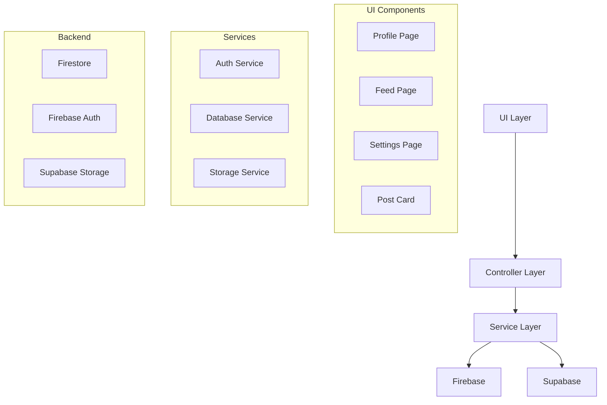
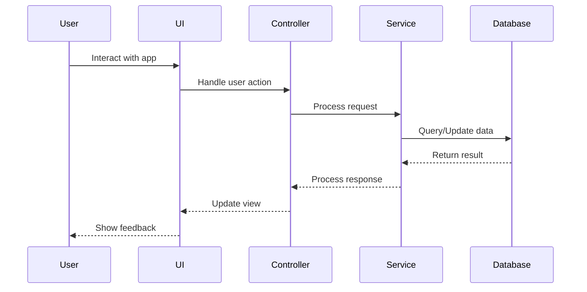

# Social Media App

<div align="center">
  
  
  [](https://flutter.dev)
  [](https://firebase.google.com)
  [](https://supabase.com)
  [](LICENSE)
</div>

## 📱 Overview

A modern social media application built with Flutter, featuring a sleek Instagram-inspired UI and robust backend integration. The app provides a seamless experience for users to share moments, connect with others, and engage with content.

## ✨ Features

- **Authentication System**
  - Secure email/password authentication
  - Profile management
  - Session handling

- **Social Features**
  - Post creation with images
  - Like and comment system
  - Follow/unfollow functionality
  - Real-time updates

- **Profile Management**
  - Customizable profiles
  - Profile picture upload
  - Bio and name editing
  - Followers/Following lists

- **Feed System**
  - Infinite scroll feed
  - Pull-to-refresh
  - Post interactions
  - Image optimization

## 🏗️ Architecture



## 📦 Project Structure

```
lib/
├── Controller/
│   ├── Services/
│   │   ├── Database/
│   │   │   └── database_services.dart
│   │   └── Auth/
│   │       └── auth_services.dart
│   └── input_controllers.dart
├── Model/
│   ├── post_model.dart
│   └── user_model.dart
├── Utils/
│   ├── Components/
│   │   └── post_card.dart
│   ├── Navigation/
│   │   └── app_custom_route.dart
│   └── event_handler.dart
└── View/
    └── Interface/
        ├── Profile/
        │   └── profile_page.dart
        ├── Settings/
        │   └── settings_page.dart
        └── Feed/
            └── interface_page.dart
```

## 🔧 Setup & Installation

1. **Prerequisites**
   - Flutter SDK (3.19.0 or higher)
   - Dart SDK (3.3.0 or higher)
   - Firebase account
   - Supabase account

2. **Configuration**
   ```bash
   # Clone the repository
   git clone https://github.com/yourusername/social_media.git
   
   # Navigate to project directory
   cd social_media
   
   # Install dependencies
   flutter pub get
   ```

3. **Environment Setup**
   - Create a Firebase project and add configuration files
   - Set up Supabase project and add credentials
   - Update configuration in `lib/config/`

## 🚀 Usage

```dart
// Example: Creating a new post
final databaseServices = DatabaseServices();
await databaseServices.createPost(
  caption: "My first post!",
  context: context,
);

// Example: Following a user
await databaseServices.toggleFollow(userId);
```

## 🔐 Security

- **Authentication**
  - Secure token-based authentication
  - Session management
  - Password encryption

- **Data Protection**
  - Firestore security rules
  - Supabase RLS policies
  - Input validation

- **Storage Security**
  - Secure file uploads
  - Image optimization
  - Access control

## 🤝 Contributing

1. Fork the repository
2. Create your feature branch (`git checkout -b feature/AmazingFeature`)
3. Commit your changes (`git commit -m 'Add some AmazingFeature'`)
4. Push to the branch (`git push origin feature/AmazingFeature`)
5. Open a Pull Request

## 📝 License

This project is licensed under the MIT License - see the [LICENSE](LICENSE) file for details.

```
MIT License

Copyright (c) 2024 [Your Name]

Permission is hereby granted, free of charge, to any person obtaining a copy
of this software and associated documentation files (the "Software"), to deal
in the Software without restriction, including without limitation the rights
to use, copy, modify, merge, publish, distribute, sublicense, and/or sell
copies of the Software, and to permit persons to whom the Software is
furnished to do so, subject to the following conditions:

The above copyright notice and this permission notice shall be included in all
copies or substantial portions of the Software.

THE SOFTWARE IS PROVIDED "AS IS", WITHOUT WARRANTY OF ANY KIND, EXPRESS OR
IMPLIED, INCLUDING BUT NOT LIMITED TO THE WARRANTIES OF MERCHANTABILITY,
FITNESS FOR A PARTICULAR PURPOSE AND NONINFRINGEMENT. IN NO EVENT SHALL THE
AUTHORS OR COPYRIGHT HOLDERS BE LIABLE FOR ANY CLAIM, DAMAGES OR OTHER
LIABILITY, WHETHER IN AN ACTION OF CONTRACT, TORT OR OTHERWISE, ARISING FROM,
OUT OF OR IN CONNECTION WITH THE SOFTWARE OR THE USE OR OTHER DEALINGS IN THE
SOFTWARE.
```

## 📊 Data Flow



## 🛠️ Dependencies

```yaml
dependencies:
  flutter:
    sdk: flutter
  firebase_core: ^2.24.2
  firebase_auth: ^4.15.3
  cloud_firestore: ^4.13.6
  supabase_flutter: ^2.3.4
  google_fonts: ^6.1.0
  iconsax: ^0.0.8
  cached_network_image: ^3.3.0
  image_picker: ^1.0.7
  provider: ^6.1.1
```

## 📱 Screenshots

<div align="center">
  
  
  
</div>

## 👥 Authors

- **Moiz Baloch** - *Initial work* - [GitHub](https://github.com/igmoiiz)

## 🙏 Acknowledgments

- Flutter team for the amazing framework
- Firebase for backend services
- Supabase for storage solutions

## 📞 Support

For support, email moaiz3110@gmail.com.

---

<div align="center">
  Made with ❤️ by [Your Name]
</div>
